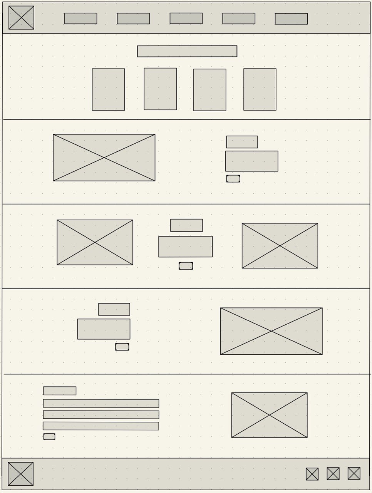
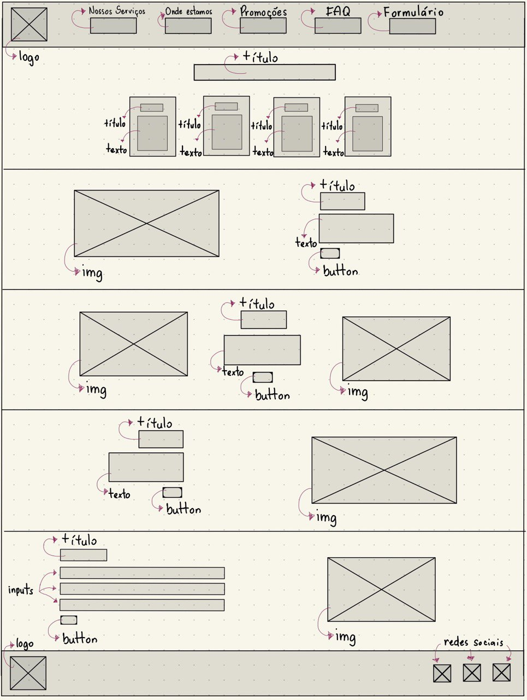
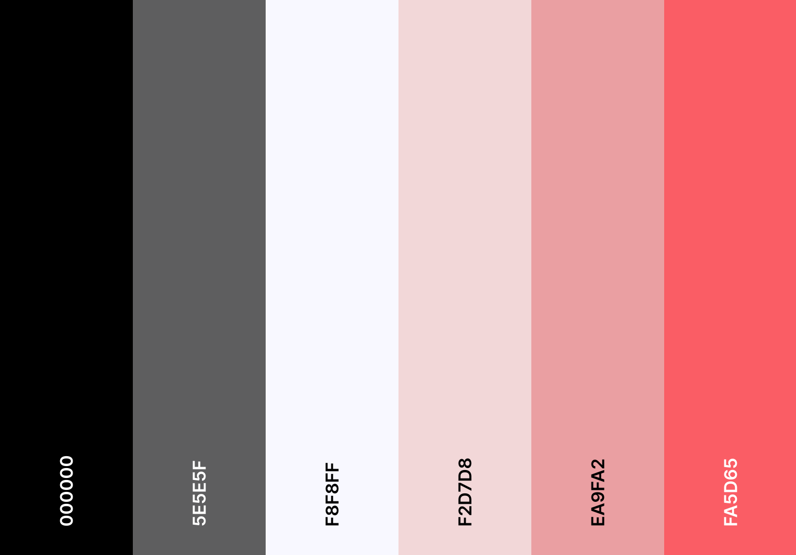

<h1 align="center"> Landing Page </h1>

<!-- 
 -->

<!--  -->

<!-- 
 -->

<strong>Status do Projeto: </strong> <i>Em Construção </i>🏗️

<strong>Tecnologias Utilizadas:</strong>
 
  

***

## Índice

* [1. Resumo do projeto](#1-resumo-do-projeto)
* [2. Desenho da interface do usuário](#2-desenho-da-interface-do-usuário)
* [3. Paleta, padrão e cores](#3-paleta-padrão-e-cores)
<!-- * [2. Instalações](#2-instalações)
* [3. Iniciando](#3-iniciando)
* [4. Como testar](#4-como-testar)
* [5. Tecnologias utilizadas](#5-tecnologias-utilizadas)
* [6. Processo de desenvolvimento](#6-processo-de-desenvolvimento)
* [7. Veja em produção](#7-veja-em-produção) -->

***

## 1. Resumo do projeto

*Landing Page* foi um projeto desenvolvido na escola de programação web full stack [Labenu](https://www.labenu.com.br/).

Nesse projeto, o objetivo era criar uma *Landing Page*, ou seja, um site de apenas uma página para atrair clientes e despertar curiosidade e interesse nos serviços e/ou produtos de uma empresa.

A partir disso, a Labenu disponibilizou uma lista de empresas fictícias da qual escolhi a *4cars* para desenvolver sua Landing Page.

A *4Cars* é uma empresa que tem surfado na onda dos apps de motoristas. Sua proposta é oferecer carros para serem alugados por motoristas a um custo razoável, aumentando a oportunidade para quem não têm dinheiro para comprar um carro. Seus concorrentes atuais são empresas tradicionais, como Localiza, e startups, como Kovi. Você tem duas linhas de produto: (i) carros populares e (ii) transporte de luxo. Você precisa criar um site capaz de comunicar modernidade e baixo custo, se posicionando como uma plataforma totalmente digital e de fácil acesso para motoristas jovens que estão buscando entrar nesse mercado.

***

## 2. Desenho da interface do usuário

O wireframe foi desenvolvido no [GoodNotes](https://www.goodnotes.com/), segue os modelos iniciais:

***

## 3. Paleta, padrão e cores
### Paleta de cores:

### Cores em hexadecimal:
`#000000`

`#5E5E5F`

`#F8F8FF`

`#F2D7D8`

`#EA9FA2`

`#FA5D65`

### Definição de cores e tamanhos:

1. Os títulos e textos terão fonte **Open Sans;**
2. Os títulos serão 2 vezes maiores que os parágrafos;
3. Os textos em parágrafos terão a cor preta;
4. Todos os botões terão cor rosa, com texto branco em fonte 1x maior que a utilizada nos parágrafos;
5. As seções terão fundo rosa, título preto, e os labels dos inputs serão pretos e brancos, respectivamente;
6. O rodapé terá a cor cinza rosa escuro.
***