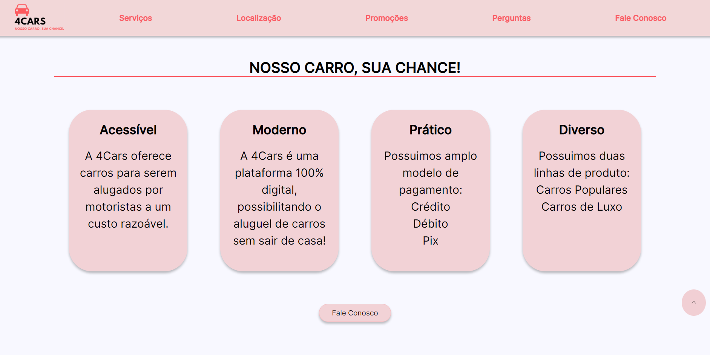
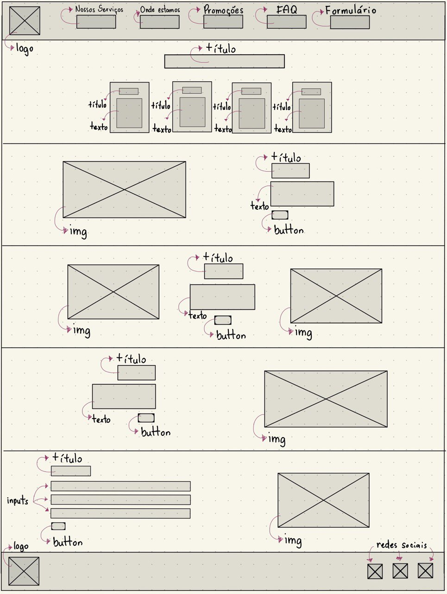
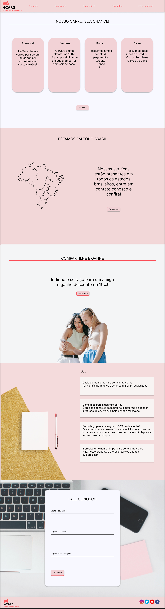
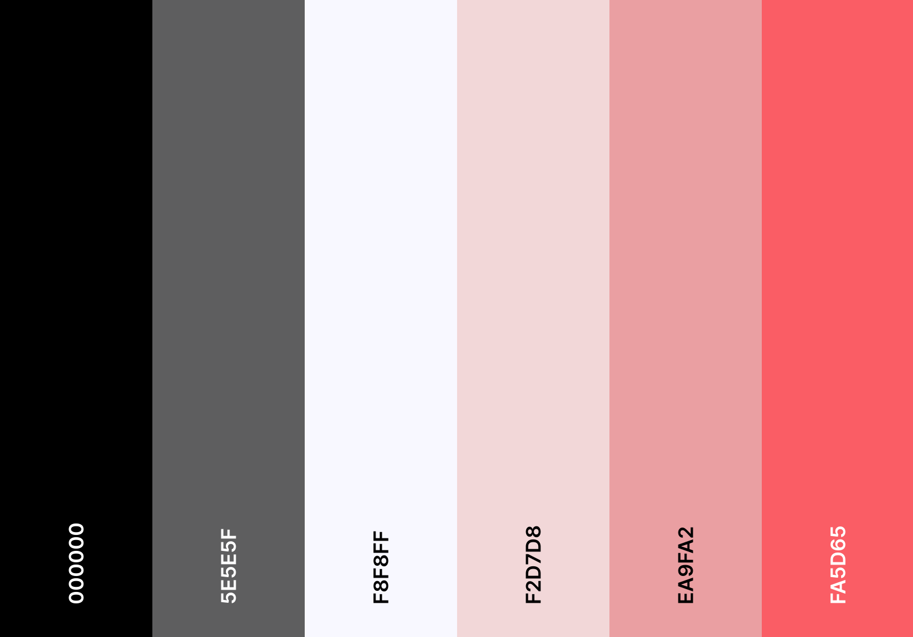

<h1 align="center"> Landing Page </h1>

Clique [aqui](projeto-landing-page-amanda-polari.surge.sh) para conferir o resultado final!

<strong>Status do Projeto: </strong> <i>Concluído</i> ✔

<strong>Tecnologias Utilizadas:</strong>
 
  

***

## Índice

* [1. Resumo do projeto](#1-resumo-do-projeto)
* [2. Desenho da interface do usuário](#2-desenho-da-interface-do-usuário)
* [3. Paleta, padrão e cores](#3-paleta-padrão-e-cores)
* [4. Gif das páginas](#4-gif-das-páginas)

***

## 1. Resumo do projeto

*Landing Page* foi um projeto desenvolvido na escola de programação web full stack [Labenu](https://www.labenu.com.br/).

Nesse projeto, o objetivo era criar uma *Landing Page*, ou seja, um site de apenas uma página para atrair clientes e despertar curiosidade e interesse nos serviços e/ou produtos de uma empresa.

A partir disso, a Labenu disponibilizou uma lista de empresas fictícias da qual escolhi a *4cars* para desenvolver sua Landing Page.

A *4Cars* é uma empresa que tem surfado na onda dos apps de motoristas. Sua proposta é oferecer carros para serem alugados por motoristas a um custo razoável, aumentando a oportunidade para quem não têm dinheiro para comprar um carro. Seus concorrentes atuais são empresas tradicionais, como Localiza, e startups, como Kovi. Você tem duas linhas de produto: (i) carros populares e (ii) transporte de luxo. Você precisa criar um site capaz de comunicar modernidade e baixo custo, se posicionando como uma plataforma totalmente digital e de fácil acesso para motoristas jovens que estão buscando entrar nesse mercado.

***

## 2. Desenho da interface do usuário

### 2.1 Wireframe

O wireframe foi desenvolvido no [GoodNotes](https://www.goodnotes.com/), segue o modelo inicial:

### 2.2 Protótipo de Alta Fidelidade
Os protótipos foram desenvolvidos no [Figma](https://www.figma.com/), e você pode conferir os modelos clicando [aqui](https://www.figma.com/file/hDtBikCgEdp8ivPGfEHyls/landing-page?node-id=0%3A1&t=HJv8MQKx9oU5JSlG-1).

#### 2.2.1 Modelo Desktop

#### 2.2.2 Modelo para Tablet
Confira [aqui](https://www.figma.com/file/hDtBikCgEdp8ivPGfEHyls/landing-page?node-id=0%3A1&t=HJv8MQKx9oU5JSlG-1).

#### 2.2.3 Modelo para iPhone 8
Confira [aqui](https://www.figma.com/file/hDtBikCgEdp8ivPGfEHyls/landing-page?node-id=0%3A1&t=HJv8MQKx9oU5JSlG-1).

***

## 3. Paleta, padrão e cores
### Paleta de cores:

### Cores em hexadecimal:
`#000000`

`#5E5E5F`

`#F8F8FF`

`#F2D7D8`

`#EA9FA2`

`#FA5D65`

***

## 4. Gif das páginas

### Desktop

### Tablet

### Mobile
